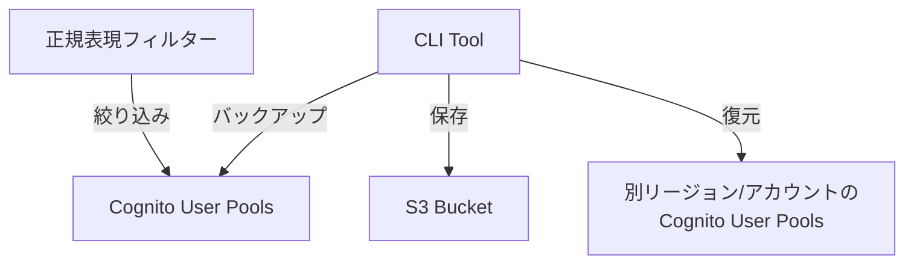

# AWS Cognito Backuper 設計概要

## 1. ツールの目的

AWS Cognito Backuper は、AWS Cognito のユーザープールとユーザー情報を包括的にバックアップし、必要に応じて別のリージョンやアカウントに復元できる CLI ツールです。

## 2. 主要機能

- 複数の Cognito ユーザープールの一括バックアップ
- 正規表現によるユーザープールのフィルタリング
- ユーザープール毎の個別バックアップファイル生成
- S3 またはローカルファイルシステムへのバックアップ保存
- KMS 暗号化によるセキュアなバックアップ
- AES-256 暗号化のためのデータキー検証

## 3. コマンド構造

```
cognito-backup
├── backup      # バックアップ機能
├── restore     # 復元機能
├── list        # ユーザープール一覧表示
└── generate-datakey  # データキー生成
```

## 4. バックアップファイル構造

```
<backup-location>/<user-pool-id>/
  - metadata.json      # バックアップメタデータ
  - pool-config.json   # プール設定
  - users.json         # ユーザー情報
```

## 5. セキュリティ機能

- AWS 認証情報の安全な管理
- S3 のサーバーサイド暗号化
- KMS による暗号化サポート
- 最小権限の原則に基づく IAM ポリシー

## 6. エラーハンドリング

- 部分的な失敗時のリトライ機能
- 処理の再開機能
- 詳細なログ出力
- ユーザープール単位での成功/失敗管理

## 7. 必要な IAM 権限

- Cognito 関連の操作権限
- S3 バケットへのアクセス権限
- KMS 暗号化キーの操作権限（暗号化使用時）

## 8. 開発環境

- Go 言語で実装
- 標準的なコーディング規約に準拠
- ユニットテスト、統合テスト、E2E テストの実装
- 詳細なドキュメント整備

## 9. システムアーキテクチャ



## 10. プロジェクト構造

```
aws_cognito_backuper/
├── cmd/
│   └── cognito-backup/
│       └── main.go
├── internal/
│   ├── backup/
│   │   ├── pool.go
│   │   └── users.go
│   ├── restore/
│   │   ├── pool.go
│   │   └── users.go
│   ├── config/
│   │   └── config.go
│   ├── filter/
│   │   └── regexp.go
│   └── aws/
│       ├── cognito.go
│       └── s3.go
├── pkg/
│   └── types/
│       └── types.go
├── go.mod
├── go.sum
└── Makefile
```

## 11. 運用考慮事項

- バックアップファイルのライフサイクル管理
- S3 バケットの容量管理
- バージョン管理
- 定期的なバックアップの自動化
- バックアップの整合性チェック

## 12. 今後の展開

- クロスリージョン/クロスアカウントでの復元機能の強化
- バックアップの自動化とスケジューリング機能
- バックアップの検証機能の強化
- ユーザーインターフェースの改善
- パフォーマンスの最適化
